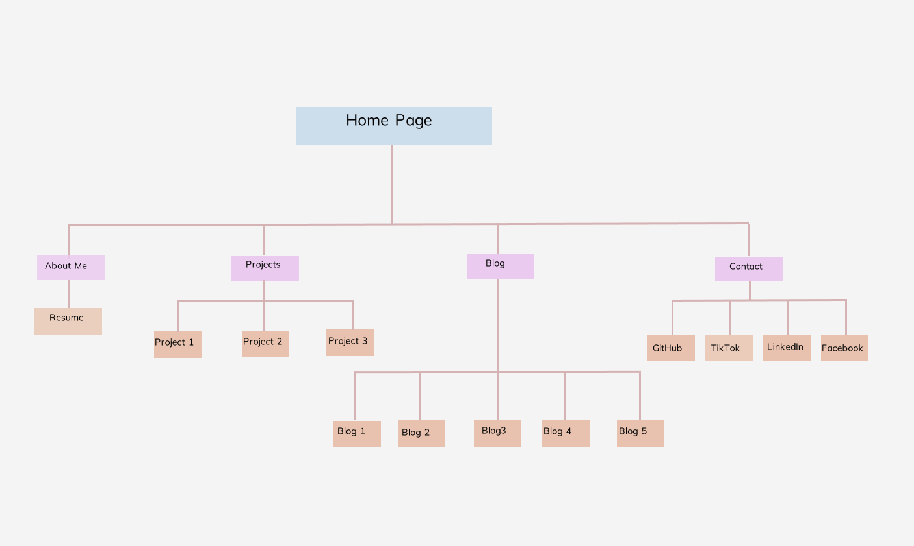

# T1-A2-Portfolio- Sharla Gilbert

## Website Link:
https://sharla-gilbert-t1-a2-portfolio.netlify.app/

## GitHub repo:
https://github.com/shgil1/T1-A2-Portfolio

## Purpose
This portfolio assignment is intended to showcase my skills, projects and experiences as an aspiring web developer. My aim is to not only showcase my technical skills but also my personality to potential employers.

### Functionality/Features
    1. Main Navigation Bar
    The main navigation bar is present at the top of each page to allow users to easily access all pages across the site, this includes the home, about me, projects, blogs and contact pages. When using a mobile device the nav bar will easily be accessed via a drop down menu. 

    2. Logo
    I designed my own custom logo on canva by incorporating my love of animals and my name written in Japanese. When selected, this logo allows users to return to the home page. 

    3. Social Media Navigation Bar
    This is located in the footer of each page and is represented by the respective media icon. When selected, a new tab opens in the browser to the corresponding platform. I have linked my github, facebook, tiktok and linkedin to allow various ways to contact me.

    4. Blog Posts
    I designed each blog post image to showcase my passion of animals and healthcare. There is a read more button located on each post and when selected, it will lead users to a dedicated blog post page. There is a "back to blog" button located at the bottom of each post to allow users to return to the main blog page. 

### Screenshots

## Sitemap

## Target audience
This portfolio is designed to demonstrate my skills and abilities to potential employers in the IT sector. I intended to highlight my previous background knowledge in healthcare and my desire to implement that in the tech space and garner interest from IT employers to collaborate in the future. 

## Tech stack
This assignment has allowed me to expand my knowledge and skills in writing HTML as well as styling each page with CSS. I utilisted both flexbox and css grid depending on my desired outcome and through a lot of trial and error I have learnt a lot about which property is best to achieve a desired layouts. 

Technology used in this portfolio:
- HTML
- CSS
- JS

Websites used in this portfolio:
- GitHub
- Figma 
- Trello

Application used to build this portfolio:
- VSCode